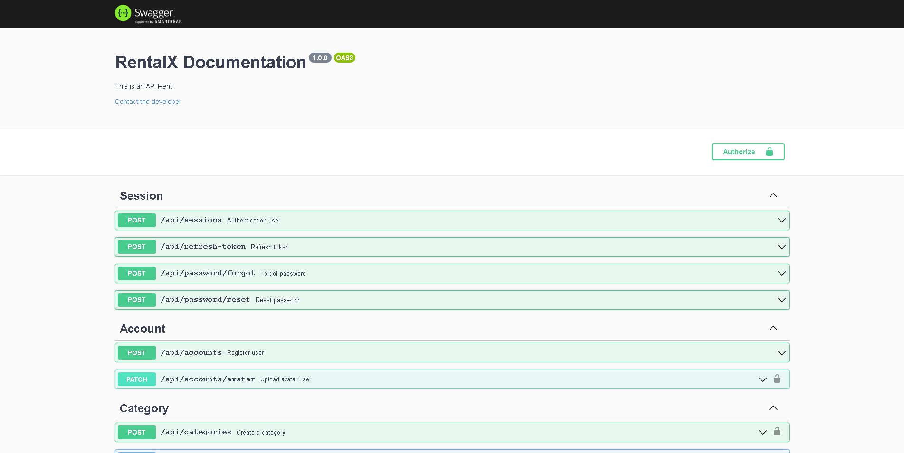
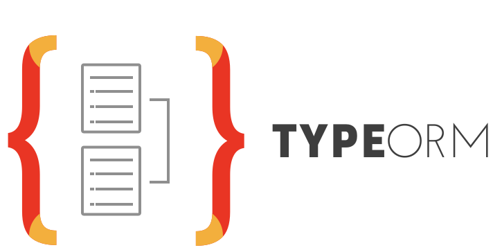

<h3 align="center">
⚡ RentalAPI - Alugel de Carros 🚗
</h3>

 

## 👀 Documentação
RENTX API conta também com a documentação que está disponível para ser consultada em <a href="http://localhost:3333/api-docs" target="_blank">http://localhost:3333/api-docs</a>

## 🚀 Tecnologias
Esse projeto foi desenvolvido com as seguintes tecnologias:
* [TypeScript](https://typescriptlang.org) - TypeScript extends JavaScript by adding types to the language.
* [Node.js](https://nodejs.org/en/) - A JavaScript runtime built on Chrome's V8 JavaScript engine.
* [ExpressJS](http://expressjs.com/) - Express is a minimal and flexible Node.js web application framework that provides a robust set of features for web and mobile applications.
* [TypeORM](https://typeorm.io) - TypeORM is an ORM that can run in NodeJS, Browser, Cordova, PhoneGap, Ionic, React Native, NativeScript, Expo, and Electron platforms and can be used with TypeScript and JavaScript (ES5, ES6, ES7, ES8).
* [PostgreSQL](https://www.postgresql.org/) - The World's Most Advanced Open Source Relational Database
* [Jest](https://jestjs.io) - Jest is a JavaScript testing framework designed to ensure correctness of any JavaScript codebase.
* [Docker](https://www.docker.com/) - Developers Love Docker. Businesses Trust It.
* [BABEL](https://babeljs.io/) - BABEL The compiler for next generation JavaScript
* [ESLint](https://eslint.org/) - ESLint is a static code analysis tool for identifying problematic patterns found in JavaScript code.
* [Prettier](https://prettier.io/) - Prettier is an opinionated code formatter with support for JavaScript, TypeScript, JSON, GraphQL...
* [AWS](https://aws.amazon.com) - Amazon Web Services (AWS) is a subsidiary of Amazon providing on-demand cloud computing platforms and APIs to individuals, companies, and governments,

## 🎉 Funcionalidades
As funcionalidades desta API são
* Cadastro do usuário ✅
* Autenticação do usuário ✅
* Perfil de usuário ✅
* Alterar imagem do perfil ✅
* Recuperação de senha do usuário ✅
* Cadastrar carro ✅
* Listar carros disponíveis ✅
* Cadastrar especificação do carro ✅
* Alterar imagens do carro ✅
* Cadastrar especificação ✅
* Listar todas as especificações ✅
* Importar categorias por panilhas (.csv) ✅
* Cadastrar categoria ✅
* Listar todas as categorias ✅
* Consultar uma categoria ✅
* Alterar uma categoria ✅
* Excluir uma categoria ✅
* Cadastrar um alugel ✅
* Devolver um carro alugado ✅
* Listar alugeis do usuário ✅

## 🤔 Como contribuir
A contribuição para projetos open-sources são sempre bem-vindas e claro o aprendizado é o retorno da contribuição.
- Faça um fork desse repositório;
- Cria uma branch com a sua feature: `git checkout -b minha-feature`;
- Faça commit das suas alterações: `git commit -m '✨ feat(minha-feature): Minha nova feature'`;
- Faça push para a sua branch: `git push origin minha-feature`.

Depois que o merge da sua pull request for feito, você pode deletar a sua branch.

---
Feito com 💚 by AlanM Franco
